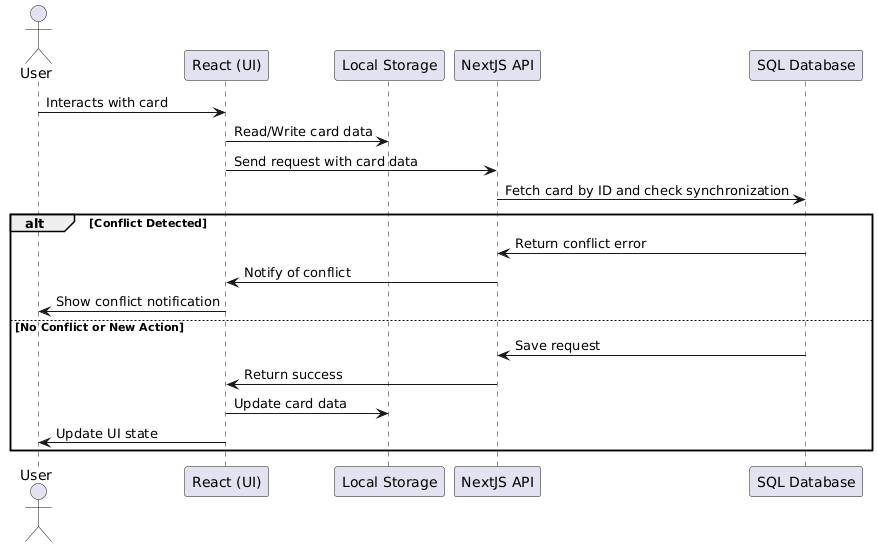

# Quickstart

To run the program you just need to:
- `npm i` or `pnpm i`
- `pnpm dev` or `npm run dev`
- Access http://localhost:3000
- Try concurrency by opening a second incognito window (which has a temporary localStorage).

- Run test with `pnpm test or npn run test`

# Definitions
First, by reading the document, we can foresee multiple challenges. Before coding, let's write down what we can define.

## Assumptions from the challenge:
- We will have only one board.
- The board can be accessed from multiple devices.
- Columns are fixed with the enum: `BACKLOG`, `TODO`, `DOING`, `DONE`.
- Data will be saved in a SQL DB and in localStorage. In DB for persistence across devices, and localstorage allowing offline.
- On startup, the board will be populated with data stored in the DB and synchronized.

## Architecture:
- Leverage a state management library to handle card actions, opting for a simpler one than Redux, like Zustand. It provides a lightweight way to manage global state within a single file.
- NextJS API to connect and synchronize data over a distant DB:
    - `GET` /api/boards
    - `GET/POST` /api/cards
    - `PUT/DELETE` /api/cards/{id}
    - `PUT` /api/cards/{id}/move
- LocalStorage to store board data as JSON. (will be limited to max MB)
- PostgreDB via Supabase for easy setup, it provies CRUD ability without having to setup a DB server, and it's also well itnegrated in the NextJS ecosystem.

## Data Model:
- **Board**
    - id
    - updated_at: TIMESTAMP
    - created_at: TIMESTAMP
- **Cards**
    - id
    - title: VARCHAR
    - description: VARCHAR
    - column: ENUM
    - updated_at: TIMESTAMP
    - created_at: TIMESTAMP

## Synchronization Process

One of the main challenges when using localStorage is keeping it updated and accurate, so this part is critical to keep data safe on both sides.

- **Logic validation**: The limit of 2 cards in the DOING state must be checked both on the back-end and front-end if someone creates one card before the other.
- **Timestamp synchronization**: We will check stale vs up-to-date data by comparing timestamps, so that if another device updates the board, we can still detect the changes.
- **Conflicts**: When a modification is made but already processed elsewhere, we will check the `updated_at` field and notify the user in case of conflict.

## UI / Front-end
- I'll use mainly Tailwind and some predefined components for cards and boards.
- Create a minimum responsiveness.

## Interaction diagram with conflicts:

# During Development Observations

- While creating the DB, I realized `column` is a SQL keyword, so I changed it to `status` for the ENUM.
- During code architecture and folder setup, I decided to put all data access abstraction within the `/api` folder, and all business logic within `/services`, which properly separates CRUD operations from business logic.
- While creating the store with Zustand (chosen because it's easier than Redux and fits this project), I realized I hadn't defined the drag-and-drop event in the UI to switch and trigger state updates. After reviewing the requirements, I saw that cards can only move one column at a time, so I opted to just use a button "Move to next". [Drag and Drop API](https://developer.mozilla.org/en-US/docs/Web/API/HTML_Drag_and_Drop_API)
- To clarify the usage of NextJS:
    - I used SSR to fetch data via the NextJS API and store it in the state, rather than using Client Side data fetching.
    - I used Supabase SDK a little bit like an ORM to manage query/insert/upsert logic, it's a good API wrapper with stronger typings.
- During the usage of Supabase, I realized that my API was a bit redundant since all modifications could be done directly with Supabase. But I decided to stick with using the API for calls to follow the challenge, as it helps separate data access from data modification (except for move operations, to demonstrate how supabase SDK works).
- Using a class repository is a design pattern I've been using for a long time. I like having service/handler and repository classes to separate data communication with the DB from business logic and the use of the data.
- By using SSR, it's impossible to check upfront if localStorage is more up-to-date than the data from the API.
- The benefits of this architecture it's that keep well separated data and business logic, the dependency injections is made with Interface
- There is a mix of OOP and functional, the OOP is used more for the logic processing/be related tasks. And the functional more related to itneratction and FE.
- The data model allows future use cases to be created, like having multiple boards if necessary.
- The tests are added at folder level since it's a small project and easy to get by, for big one it may be interesting to have all test in a global folder.
- The tests were done after the development, to follow TDD practices, we could have define all the cases from the challenge before developing., like the limite of card in DOING, the unmovable card from DONE etc.
- Used Generative AI to generate test cases which is a bit of a boilerplate code, i defined in prompt what i wanted to test and ask for the descriptions.
- In those tests, i tested repository and services, since API is more like an HTTP wrapper of card-repository interactions with DB.

# To Improve

- Leverage localStorage and log all changes to sync back with the DB by comparing timestamps after losing internet connection. To create a PWA style leveraging a webworker for synchronization.
- Use optimistic UI updates rather than synchronous ones, to give a more real-time feeling, in case of server rejection the UI client will revert the changes
- We could use Websocket to create a real-time update or create long polling to update the board when someone else update it.
- In a scalable APP, I would separate BE and FE responsabilities more, API would be on a seperate server and ensure single operations of logic with DB.
- Add E2E to simulate user behavior
- Add security over the API with JWT or other tokens mechanism.